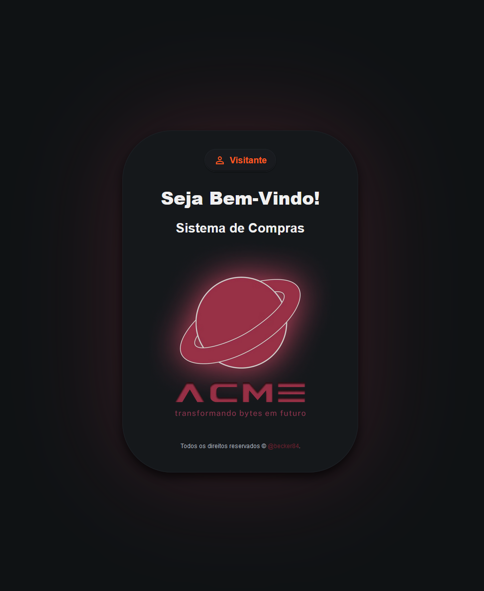
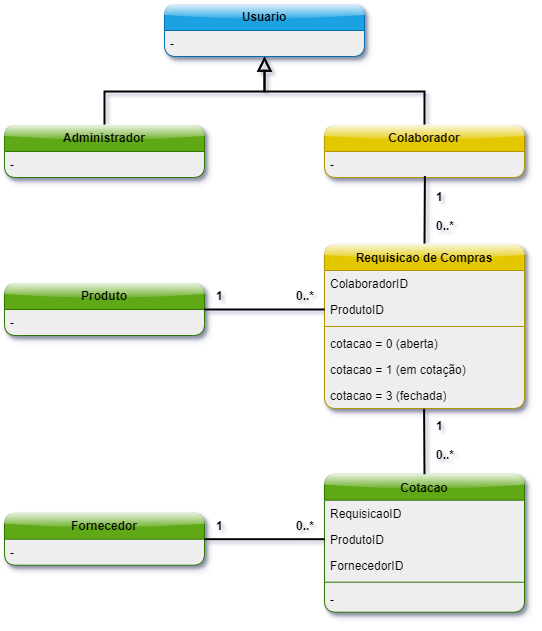
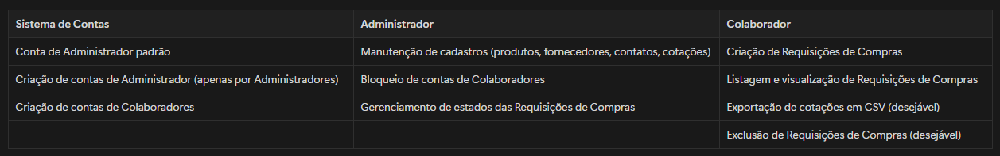
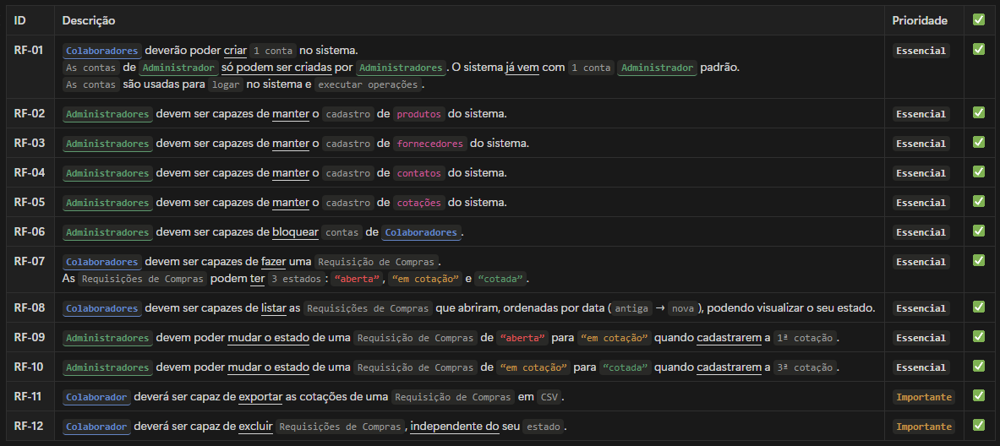
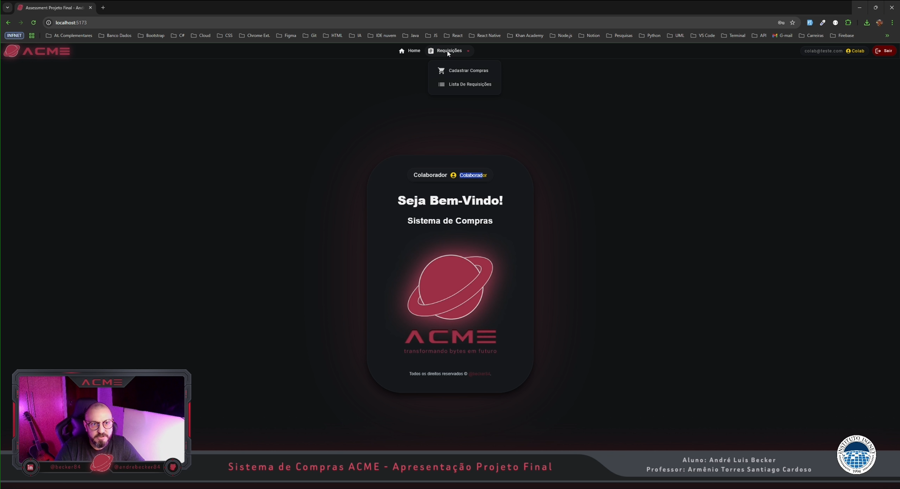

# Sistema de Compras - ACME (React.JS)

  

 

  
    
  <strong>Projeto Bloco - Desenvolvimento Front-end com Frameworks</strong>
    
  <strong>Professor: Armênio Torres Santiago Cardoso</strong>
    
  <strong>Aluno: André Luis Becker</strong> 

#

 

  
  
  

#

  

## Diagrama de Classes:

  

    
  

## Funcionalidades Principais:

  

   
  

## Requisitos Funcionais:

  

    
  

## Apresentação:

  

    
  

  

     
    

    <strong align="center">Obrigado pela sua visita. André Luis Becker.</strong>
     

