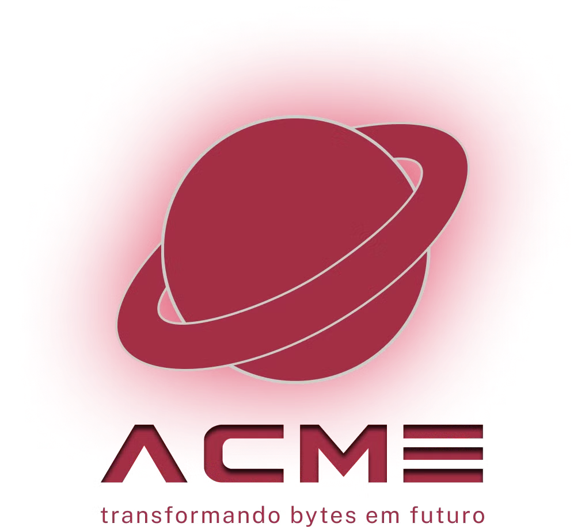

# Projeto de Exercícios React

  

  <strong>Projeto Bloco - Desenvolvimento Front-end com Frameworks</strong> 
  <strong>Professor: Armênio Torres Santiago Cardoso</strong> 
  <strong>Aluno: André Luis Becker</strong>

  <strong>Sistema de Compras - ACME</strong> 
  

  
  
  

  

## Diagrama de Classes:

  

    
  

## Funcionalidades Principais:

  

   
  

## Requisitos Funcionais:

  

    
  

## Apresentação:

  

    
  

  

     
    

     
    <strong>Obrigado pela visita!</strong>

